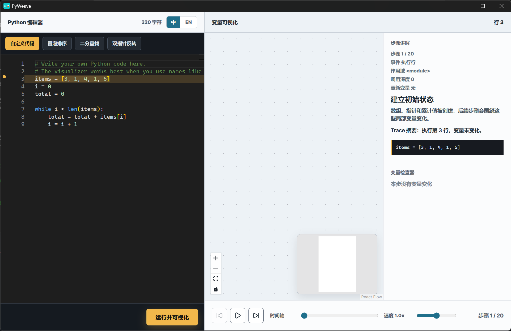
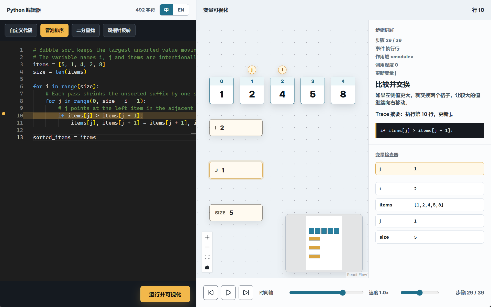

# PyWeave

PyWeave is a desktop algorithm visualization app for Python code. It combines a
Monaco-based Python editor with a React Flow variable graph, then uses a Tauri
backend with PyO3 to collect line-by-line trace data in an isolated worker
process.





## Features

- Edit and run Python code inside the app.
- Visualize Python locals as variable and array nodes.
- See pointer labels directly on array cells.
- Keep large lists, tuples and dictionaries responsive through explicit previews.
- Step through captured execution states.
- Review localized step guidance, trace summaries, current line context and variable changes.
- Play, pause and change playback speed.
- Run the current editor with `Ctrl+Enter`.
- Switch the UI between Chinese and English.
- Start from built-in templates:
  - Custom Code
  - Bubble Sort
  - Binary Search
  - Two-Pointer Reverse
- See syntax and runtime errors with line information.
- Run Python tracing in a separate worker process with explicit timeout handling.

## Tech Stack

- Tauri 2
- React 19
- TypeScript
- Vite
- Monaco Editor
- React Flow
- Rust
- PyO3

## Requirements

- Node.js
- npm
- Rust
- Python 3
- Tauri system dependencies for your operating system

Python must be available on the machine because PyWeave executes user-provided
Python code through the native Tauri backend worker.

## Security Model

PyWeave runs Python locally for algorithm visualization. The Tauri command
starts a dedicated trace worker process and communicates with it through a JSON
stdin/stdout protocol. If the worker exceeds the configured timeout, the parent
process terminates it and reports a `WorkerTimeout` error.

By default, the backend accepts a restricted Python subset: basic control flow,
functions, indexing, literals and a small set of safe builtins such as `len`,
`range`, `list`, `min`, `max`, `sum` and `sorted`. Imports, attribute access,
classes, lambdas and indirect calls are rejected with an explicit line-numbered
error.

Set `PYWEAVE_ALLOW_UNRESTRICTED_PYTHON=1` only for trusted local code when full
Python execution is required. Unrestricted mode gives code the same host access
as the desktop process.

Trace capture is bounded by `MAX_TRACE_EVENTS` in the backend and by a local
snapshot byte limit. Large lists, tuples and dictionaries are serialized as
explicit preview objects after `PYWEAVE_VALUE_PREVIEW_ITEMS=96` captured items.
Set `PYWEAVE_VALUE_PREVIEW_ITEMS=0` to disable value previews for trusted local
debugging. Set `PYWEAVE_MAX_SNAPSHOT_BYTES=0` to disable the snapshot size limit
for trusted local experiments.

Trace worker execution uses `PYWEAVE_TRACE_TIMEOUT_MS=5000` by default. Set it
to another positive integer to change the timeout, or `0` to disable the timeout
for trusted local debugging.

## Install

```bash
npm install
```

## Development

Check local desktop prerequisites:

```bash
npm run doctor
```

Run the Tauri desktop app in development mode:

```bash
npm run dev:desktop
```

Run the frontend dev server only:

```bash
npm run dev
```

## Build

Build the frontend:

```bash
npm run build
```

Build the desktop app:

```bash
npm run tauri -- build
```

Generated installers and binaries are written under `src-tauri/target/`.

## Tests

Run the Rust backend tests:

```bash
npm run test:backend
```

Run the TypeScript derivation and localization tests:

```bash
npm test
```

Run the Playwright visual workflow test:

```bash
npm run test:e2e
```

Run the full local verification set:

```bash
npm run test:all
```

## Project Structure

```text
.
+-- src/                  # React frontend
+-- src-tauri/            # Tauri and Rust backend
|   +-- src/              # Rust tracing and Python execution code
|   +-- capabilities/     # Tauri capability config
|   +-- icons/            # App icons
|   +-- tauri.conf.json   # Tauri app config
+-- index.html
+-- package.json
+-- tsconfig.json
+-- vite.config.ts
```

## Notes

PyWeave traces line events from Python code and displays values that can be
serialized for visualization. It works best when algorithms use clear variable
names such as `items`, `i`, `j`, `left`, `right` and `mid`.
